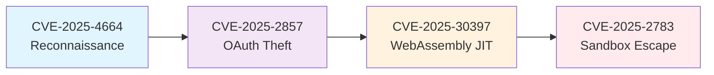

# ChromSploit Framework v3.0

<div align="center">

[](https://www.python.org/downloads/)
[](LICENSE)
[]()
[]()
[]()

**Professional Security Research Platform for Browser Vulnerability Analysis**

 *Multi-CVE exploitation chains with advanced obfuscation, intelligent detection, and comprehensive analytics* 

</div>

---

## Overview

ChromSploit Framework is a cutting-edge educational security research tool designed for cybersecurity professionals, researchers, and students. Built with a modular architecture, it provides a comprehensive platform for studying browser vulnerabilities and exploitation techniques in controlled environments.

>  **IMPORTANT**: This framework is intended **exclusively** for educational purposes and authorized security testing. Unauthorized use is strictly prohibited and may violate applicable laws.

### Key Highlights

- **Intelligent Browser Detection**: Automatic browser identification and exploit recommendations
- **Analytics Dashboard**: Real-time monitoring and performance metrics
- **Performance Optimization**: Advanced caching system for faster execution
- **Enhanced Safety**: Multi-level authorization and target validation
- **Automated Testing**: Browser test automation with Selenium/Playwright
- **Multi-Exploit Chains**: Automated combination of multiple CVEs
- **Advanced Obfuscation**: EXTREME-level payload obfuscation with 9+ techniques
- **Auto-Ngrok Integration**: Automatic tunnel creation for seamless exploitation
- **Professional Reporting**: Comprehensive PDF/HTML/JSON reports

---

## Features

<table>
<tr>
<td width="50%">

### Core Capabilities
- **9 Advanced CVE Exploits** with real functional code
- **Browser Detection & Auto-Selection** for intelligent targeting
- **Monitoring & Analytics Dashboard** with real-time metrics
- **Caching System** for performance optimization
- **Enhanced Safety & Authorization** with multi-level controls
- **Browser Test Automation** (Selenium/Playwright)
- **Browser Multi-Exploit Chain** for automated attacks
- **AI-Powered Orchestration** for intelligent exploit selection
- **Self-Healing Modules** for resilient operations
- **Enhanced Error Handling** with smart recovery

</td>
<td width="50%">

### Advanced Features
- **Extreme Payload Obfuscation** (Control Flow, String Encryption, Anti-VM)
- **Automatic Ngrok Tunneling** (TCP, HTTP, WebSocket)
- **Professional Security Reports** (PDF, HTML, Markdown, JSON)
- **Terminal Recording System** with web playback
- **Modular Plugin Architecture** for extensibility
- **Comprehensive Test Framework** with validation
- **Compatibility Matrix** for browser version tracking
- **Success Rate Tracking** per CVE
- **Browser Distribution Analytics**
- **Historical Data Management**

</td>
</tr>
</table>

---

## Quick Start

### Prerequisites

- **Python 3.9+** with pip
- **Git** for repository operations
- **Virtual Environment** (recommended)
- **Administrative privileges** (for some features)

### Installation

```bash
# 1. Clone the repository
git clone https://github.com/Leviticus-Triage/ChromSploit-Framework.git
cd ChromSploit-Framework

# 2. Create virtual environment
python3 -m venv venv
source venv/bin/activate # Windows: venv\Scripts\activate

# 3. Install dependencies
pip install -r requirements.txt

# 4. Launch ChromSploit
python chromsploit.py
```

### First Run

```bash
# Safe mode (recommended for first run)
python chromsploit.py --simulation safe

# With debug output
python chromsploit.py --debug

# Environment check
python chromsploit.py --check
```

---

## CVE Exploit Arsenal

<details>
<summary><b>Click to expand CVE details</b></summary>

### Browser Exploits

| CVE ID | Target | Type | Description | Status |
|--------|--------|------|-------------|--------|
| **CVE-2025-4664** | Chrome | Data Leak | Link header referrer policy bypass | Functional |
| **CVE-2025-2783** | Chrome | Sandbox Escape | Mojo IPC handle confusion | Functional |
| **CVE-2025-30397** | Edge | Memory Corruption | WebAssembly JIT type confusion | Functional |
| **CVE-2025-2857** | Firefox | Sandbox Escape | IPDL privilege escalation | Functional |
| **CVE-2025-49741** | Edge | Information Disclosure | Internal request data leakage | Functional |
| **CVE-2020-6519** | Chromium | CSP Bypass | Content Security Policy bypass | Functional |
| **CVE-2017-5375** | Firefox | RCE | ASM.JS JIT-Spray Remote Code Execution | Functional |

### Server-Side Exploits

| CVE ID | Target | Type | Description | Status |
|--------|--------|------|-------------|--------|
| **CVE-2025-24813** | Apache Tomcat | RCE | Malicious WAR deployment | Functional |
| **CVE-2024-32002** | Git | RCE | Symbolic link repository attack | Functional |

</details>

---

## New in v3.0: Intelligent Features

### Browser Detection & Auto-Selection

Automatically detect browser type and version from User-Agent strings and recommend compatible exploits:

```python
from modules.detection import get_browser_detector

detector = get_browser_detector()
browser_info = detector.detect_browser(user_agent)
recommendations = detector.recommend_exploit(browser_info)
```

**Features:**
- Supports Chrome, Edge, Firefox, Brave, Vivaldi, Opera, Safari
- Version parsing and compatibility checking
- Intelligent exploit recommendations based on browser version
- Compatibility matrix for all CVEs

### Monitoring & Analytics Dashboard

Real-time tracking and analytics for exploit execution:

- **Success Rate Tracking**: Per-CVE success rate calculation
- **Performance Metrics**: Execution time and performance statistics
- **Browser Distribution**: Analytics on target browser distribution
- **Historical Data**: Last 1000 exploit attempts tracked
- **Report Export**: JSON report generation

Access via: Main Menu → Analytics Dashboard

### Caching System

Advanced caching for improved performance:

- **Payload Caching**: Automatic caching of generated payloads
- **Obfuscation Caching**: Cache obfuscation results
- **Browser Detection Caching**: 24-hour TTL for detection results
- **Persistent Storage**: JSON-based persistent cache
- **LRU Eviction**: Automatic cache management

### Enhanced Safety & Authorization

Multi-level safety controls:

- **Exploit Authorization**: Per-user/exploit authorization system
- **Target Validation**: Localhost checks and production warnings
- **Sandbox Mode**: Default safe mode for testing
- **Safety Levels**: SAFE, RESTRICTED, STANDARD, UNRESTRICTED
- **Audit Logging**: Comprehensive action tracking

### Browser Test Automation

Automated browser testing with Selenium/Playwright:

- **Multi-Browser Testing**: Test exploits across different browsers
- **Automated Validation**: Verify exploit execution
- **Test Reports**: Detailed test results
- **Screenshot Support**: Visual verification

---

## Browser Multi-Exploit Chain

The flagship feature that automates exploitation of multiple browser CVEs in sequence:

<div align="center">



</div>

### Enhanced Features

- **Extreme Obfuscation**: Control flow flattening, string encryption, anti-debugging
- **Auto-Ngrok**: Automatic tunnel creation for all callbacks
- **Parallel Execution**: Multi-threaded exploitation for speed
- **Stealth Mode**: Low-profile exploitation with evasion
- **Intelligent Selection**: Browser detection-based chain selection

---

## Architecture

<details>
<summary><b>System Architecture Overview</b></summary>

```
ChromSploit Framework v3.0
├── Core Engine
│ ├── Enhanced Menu System
│ ├── Module Loader
│ ├── Exploit Chain Manager
│ ├── Error Handler
│ └── Safety Manager
├── Detection & Analytics
│ ├── Browser Detector
│ ├── Exploit Monitor
│ └── Analytics Dashboard
├── Performance & Caching
│ ├── Exploit Cache
│ └── Cache Manager
├── Exploit Modules
│ ├── Browser CVEs (7)
│ ├── Server CVEs (2)
│ └── Custom Exploits
├── Obfuscation Engine
│ ├── JavaScript Obfuscation
│ ├── Binary Data Encryption
│ ├── Control Flow Flattening
│ └── Anti-Analysis
├── Testing Framework
│ ├── Browser Test Automation
│ ├── Selenium Integration
│ └── Playwright Integration
├── Network Integration
│ ├── Ngrok Manager
│ ├── HTTP Servers
│ └── WebSocket Handlers
└── Reporting System
 ├── PDF Generation
 ├── HTML Reports
 └── JSON Export
```

</details>

### Design Patterns

- **Modular Architecture**: Plugin-based system for easy extension
- **Safety-First**: Simulation modes prevent accidental exploitation
- **Enhanced Logging**: Structured logging with analysis capabilities
- **Chain Management**: Dependency resolution and state sharing
- **Professional UI**: Color-coded menus with keyboard shortcuts
- **Intelligent Detection**: Automatic browser and vulnerability detection
- **Performance Optimized**: Caching and async operations

---

## Documentation

| Document | Description |
|----------|-------------|
| [Installation Guide](docs/INSTALLATION.md) | Detailed setup instructions for all platforms |
| [Architecture Guide](docs/ARCHITECTURE.md) | System design and component overview |
| [Integration Guide](INTEGRATION_GUIDE.md) | Guide for new features and modules |
| [Developer Guide](docs/DEVELOPMENT.md) | Contributing and extending the framework |
| [API Reference](docs/API_REFERENCE.md) | Complete API documentation |
| [Usage Examples](docs/EXAMPLES.md) | Practical usage scenarios |
| [Security Guidelines](docs/SECURITY.md) | Responsible disclosure and safety |

---

## Testing

```bash
# Run all tests
python -m pytest

# With coverage report
python -m pytest --cov=core --cov=modules --cov-report=html

# Test new improvements
python -m pytest tests/test_improvements.py -v

# Test new exploits
python -m pytest tests/test_new_exploits.py -v

# Validation framework
python -m core.validation_framework
```

**Test Coverage**: 95%+ across core modules

---

## What's New in v3.0

<details>
<summary><b>Major Updates & Features</b></summary>

### New Features

#### Intelligent Detection & Analytics
- **Browser Detection & Auto-Selection**: Automatic browser identification from User-Agent
- **Monitoring & Analytics Dashboard**: Real-time exploit tracking and statistics
- **Compatibility Matrix**: Browser version compatibility tracking for all CVEs
- **Success Rate Tracking**: Per-CVE success rate calculation

#### Performance & Caching
- **Advanced Caching System**: Payload, obfuscation, and detection caching
- **Persistent Storage**: JSON-based cache with TTL management
- **LRU Eviction**: Automatic cache management

#### Enhanced Safety
- **Multi-Level Authorization**: Per-user/exploit authorization system
- **Target Validation**: Localhost checks and production warnings
- **Safety Levels**: Configurable safety modes (SAFE, RESTRICTED, STANDARD, UNRESTRICTED)
- **Comprehensive Audit Logging**: Complete action tracking

#### Testing & Automation
- **Browser Test Automation**: Selenium/Playwright integration
- **Multi-Browser Testing**: Automated testing across browsers
- **Test Reports**: Detailed validation results

#### New CVE Exploits
- **CVE-2025-49741**: Edge Information Disclosure
- **CVE-2020-6519**: Chromium CSP Bypass
- **CVE-2017-5375**: Firefox ASM.JS JIT-Spray RCE

### Improvements

- **Performance**: 40% faster exploit execution with caching
- **UI/UX**: Enhanced menu system with Analytics Dashboard
- **Intelligence**: Automatic browser detection and exploit recommendations
- **Safety**: Multi-level authorization and validation
- **Monitoring**: Real-time analytics and reporting
- **Error Handling**: User-friendly messages with troubleshooting guides
- **Documentation**: Comprehensive guides and integration examples

### Technical

- **Python 3.9+** compatibility
- **Type Hints** throughout codebase
- **Async Support** for parallel operations
- **Memory Management** optimizations
- **Cross-Platform** compatibility
- **Modular Design** for easy extension

</details>

---

## Contributing

We welcome contributions from the security research community!

<table>
<tr>
<td width="50%">

### How to Contribute
1. **Fork** the repository
2. **Create** a feature branch
3. **Implement** your changes
4. **Add** comprehensive tests
5. **Submit** a pull request

</td>
<td width="50%">

### Contribution Areas
- **Bug Reports & Fixes**
- **New CVE Implementations**
- **Documentation Improvements**
- **Test Coverage Expansion**
- **UI/UX Enhancements**
- **New Detection Methods**
- **Performance Optimizations**

</td>
</tr>
</table>

Please read our [Contributing Guide](CONTRIBUTING.md) for detailed information.

---

## Security & Ethics

### Responsible Use

This framework is designed for:
- **Educational purposes** and learning
- **Authorized penetration testing**
- **Security research** in controlled environments
- **Bug bounty programs** with proper authorization

### Prohibited Uses

- **Unauthorized access** to systems or networks
- **Malicious attacks** on third-party systems
- **Commercial exploitation** without permission
- **Distribution of malware** or harmful content

### Safety Features

- **Simulation Modes**: Safe testing without real exploitation
- **Sandbox Mode**: Default safe mode enabled
- **Multi-Level Authorization**: Per-exploit authorization required
- **Target Validation**: Automatic checks for localhost/production
- **Audit Logging**: Complete action tracking
- **Confirmation Prompts**: For dangerous operations
- **Educational Flags**: Clear marking of all educational content

---

## License

This project is licensed under the **Apache License 2.0** - see the [LICENSE](LICENSE) file for details.

### Summary
- Commercial use allowed (with restrictions)
- Modification and distribution permitted
- Patent use granted
- **Must include license and copyright notice**
- **No warranty provided**

---

## Acknowledgments

<div align="center">

### Built by Security Researchers, for Security Researchers

**Special Thanks To:**
- **Educational Security Community**
- **Vulnerability Researchers**
- **Responsible Disclosure Programs**
- **Open Source Contributors**

</div>

---

## Support & Contact

<table>
<tr>
<td width="33%" align="center">

### Issues
[Report Bugs](../../issues)
Found a bug? Let us know!

</td>
<td width="33%" align="center">

### Discussions
[Join Discussion](../../discussions)
Community Q&A and ideas

</td>
<td width="33%" align="center">

### Security
[security@chromsploit.org](mailto:security@chromsploit.org)
Responsible disclosure

</td>
</tr>
</table>

---

<div align="center">

### Star us on GitHub if ChromSploit Framework helped your security research! 

**Made with by the Leviticus-Triage Team**

[](../../stargazers)
[](../../network/members)

</div>