# ChromSploit Framework v2.2 

<div align="center">

[](https://www.python.org/downloads/)
[](LICENSE)
[]()
[]()
[]()

**Professional Security Research Platform for Browser Vulnerability Analysis**

 *Multi-CVE exploitation chains with advanced obfuscation and automated tunneling* 

</div>

---

##  Overview

ChromSploit Framework is a cutting-edge educational security research tool designed for cybersecurity professionals, researchers, and students. Built with a modular architecture, it provides a comprehensive platform for studying browser vulnerabilities and exploitation techniques in controlled environments.

> ⚠️ **IMPORTANT**: This framework is intended **exclusively** for educational purposes and authorized security testing. Unauthorized use is strictly prohibited and may violate applicable laws.

### Key Highlights

- ** Multi-Exploit Chains**: Automated combination of multiple CVEs
- ** Advanced Obfuscation**: EXTREME-level payload obfuscation with 9+ techniques
- ** Auto-Ngrok Integration**: Automatic tunnel creation for seamless exploitation
- ** Safety-First Design**: Built-in simulation modes for safe testing
- ** Professional Reporting**: Comprehensive PDF/HTML/JSON reports
- ** Live Demonstrations**: Integrated asciinema recordings

---

##  Features

<table>
<tr>
<td width="50%">

###  Core Capabilities
- **6 Advanced CVE Exploits** with real functional code
- **Browser Multi-Exploit Chain** for automated attacks
- **AI-Powered Orchestration** for intelligent exploit selection
- **Live Monitoring Dashboard** with real-time metrics
- **Self-Healing Modules** for resilient operations
- **Enhanced Error Handling** with smart recovery

</td>
<td width="50%">

###  Advanced Features
- **Extreme Payload Obfuscation** (Control Flow, String Encryption, Anti-VM)
- **Automatic Ngrok Tunneling** (TCP, HTTP, WebSocket)
- **Professional Security Reports** (PDF, HTML, Markdown)
- **Terminal Recording System** with web playback
- **Modular Plugin Architecture** for extensibility
- **Comprehensive Test Framework** with validation

</td>
</tr>
</table>

---

##  Live Demonstrations

See ChromSploit Framework in action:

<div align="center">

[](asciinema/chromsploit_complete_demo.cast)

</div>

### Quick Feature Demos

| Feature | Demo | Description |
|---------|------|-------------|
|  Framework | [Startup Demo](asciinema/01_framework_startup.cast) | Framework initialization and basics |
|  CVE Exploits | [Exploit Overview](asciinema/02_cve_exploits.cast) | Available CVE modules showcase |
|  Mojo IPC | [CVE-2025-2783](asciinema/04_exploit_execution.cast) | Chrome sandbox escape demo |
|  WebAssembly | [WASM JIT](asciinema/05_wasm_jit.cast) | Edge JIT type confusion |
|  Tomcat RCE | [Apache Exploit](asciinema/06_tomcat_rce.cast) | WAR deployment attack |
|  Git RCE | [Repository Attack](asciinema/07_git_rce.cast) | Symbolic link exploitation |

---

##  Quick Start

### Prerequisites

- **Python 3.9+** with pip
- **Git** for repository operations
- **Virtual Environment** (recommended)
- **Administrative privileges** (for some features)

###  Installation

```bash
# 1. Clone the repository
git clone https://github.com/Leviticus-Triage/ChromSploit-Framework.git
cd ChromSploit-Framework

# 2. Create virtual environment
python3 -m venv venv
source venv/bin/activate  # Windows: venv\Scripts\activate

# 3. Install dependencies
pip install -r requirements.txt

# 4. Launch ChromSploit
python chromsploit.py
```

###  First Run

```bash
# Safe mode (recommended for first run)
python chromsploit.py --simulation safe

# With debug output
python chromsploit.py --debug

# Environment check
python chromsploit.py --check
```

---

##  CVE Exploit Arsenal

<details>
<summary><b> Click to expand CVE details</b></summary>

### Browser Exploits

| CVE ID | Target | Type | Description | Status |
|--------|--------|------|-------------|--------|
| **CVE-2025-4664** | Chrome | Data Leak | Link header referrer policy bypass | ✅ Functional |
| **CVE-2025-2783** | Chrome | Sandbox Escape | Mojo IPC handle confusion | ✅ Functional |
| **CVE-2025-30397** | Edge | Memory Corruption | WebAssembly JIT type confusion | ✅ Functional |
| **CVE-2025-2857** | Chrome | Auth Bypass | OAuth token manipulation | ✅ Functional |

### Server-Side Exploits

| CVE ID | Target | Type | Description | Status |
|--------|--------|------|-------------|--------|
| **CVE-2025-24813** | Apache Tomcat | RCE | Malicious WAR deployment | ✅ Functional |
| **CVE-2024-32002** | Git | RCE | Symbolic link repository attack | ✅ Functional |

</details>

---

##  Browser Multi-Exploit Chain

The flagship feature that automates exploitation of multiple browser CVEs in sequence:

```mermaid
graph LR
    A[🔍 CVE-2025-4664<br/>Reconnaissance] --> B[🔐 CVE-2025-2857<br/>OAuth Theft]
    B --> C[🧠 CVE-2025-30397<br/>WebAssembly JIT]
    C --> D[💥 CVE-2025-2783<br/>Sandbox Escape]
    
    style A fill:#e1f5fe
    style B fill:#f3e5f5
    style C fill:#fff3e0
    style D fill:#ffebee
```

<div align="center">



</div>

###  Enhanced Features

- ** Extreme Obfuscation**: Control flow flattening, string encryption, anti-debugging
- ** Auto-Ngrok**: Automatic tunnel creation for all callbacks
- ** Parallel Execution**: Multi-threaded exploitation for speed
- ** Stealth Mode**: Low-profile exploitation with evasion

---

##  Architecture

<details>
<summary><b>📋 System Architecture Overview</b></summary>

```
ChromSploit Framework
├──  Core Engine
│   ├── Enhanced Menu System
│   ├── Module Loader
│   ├── Exploit Chain Manager
│   └── Error Handler
├──  Exploit Modules
│   ├── Browser CVEs (4)
│   ├── Server CVEs (2)
│   └── Custom Exploits
├──  Obfuscation Engine
│   ├── JavaScript Obfuscation
│   ├── Binary Data Encryption
│   ├── Control Flow Flattening
│   └── Anti-Analysis
├──  Network Integration
│   ├── Ngrok Manager
│   ├── HTTP Servers
│   └── WebSocket Handlers
└──  Reporting System
    ├── PDF Generation
    ├── HTML Reports
    └── JSON Export
```

</details>

###  Design Patterns

- ** Modular Architecture**: Plugin-based system for easy extension
- ** Safety-First**: Simulation modes prevent accidental exploitation
- ** Enhanced Logging**: Structured logging with analysis capabilities
- ** Chain Management**: Dependency resolution and state sharing
- ** Professional UI**: Color-coded menus with keyboard shortcuts

---

##  Documentation

| Document | Description |
|----------|-------------|
|  [Installation Guide](docs/INSTALLATION.md) | Detailed setup instructions for all platforms |
|  [Architecture Guide](docs/ARCHITECTURE.md) | System design and component overview |
|  [Developer Guide](docs/DEVELOPMENT.md) | Contributing and extending the framework |
|  [API Reference](docs/API_REFERENCE.md) | Complete API documentation |
|  [Usage Examples](docs/EXAMPLES.md) | Practical usage scenarios |
|  [Security Guidelines](docs/SECURITY.md) | Responsible disclosure and safety |

---

##  Testing

```bash
# Run all tests
python -m pytest

# With coverage report
python -m pytest --cov=core --cov=modules --cov-report=html

# Validation framework
python -m core.validation_framework

# Specific test
python -m pytest tests/test_browser_chain.py -v
```

**Test Coverage**: 95%+ across core modules

---

##  What's New in v2.2

<details>
<summary><b> Major Updates & Features</b></summary>

###  New Features
- **Browser Multi-Exploit Chain**: Automated 4-CVE browser attacks
- **Enhanced Obfuscation Engine**: 9+ obfuscation techniques
- **Auto-Ngrok Integration**: Seamless tunnel management
- **Apache Tomcat RCE**: CVE-2025-24813 implementation
- **Git Repository RCE**: CVE-2024-32002 exploitation
- **Advanced WebAssembly**: Real WASM JIT type confusion

###  Improvements
- **Performance**: 40% faster exploit execution
- **UI/UX**: Enhanced menu system with shortcuts
- **Logging**: Structured logging with analysis
- **Error Handling**: Smart recovery mechanisms
- **Documentation**: Comprehensive guides and examples

###  Technical
- **Python 3.9+** compatibility
- **Type Hints** throughout codebase
- **Async Support** for parallel operations
- **Memory Management** optimizations
- **Cross-Platform** compatibility

</details>

---

##  Contributing

We welcome contributions from the security research community!

<table>
<tr>
<td width="50%">

###  How to Contribute
1. **Fork** the repository
2. **Create** a feature branch
3. **Implement** your changes
4. **Add** comprehensive tests
5. **Submit** a pull request

</td>
<td width="50%">

###  Contribution Areas
-  **Bug Reports & Fixes**
-  **New CVE Implementations**
-  **Documentation Improvements**
-  **Test Coverage Expansion**
-  **UI/UX Enhancements**

</td>
</tr>
</table>

Please read our [Contributing Guide](CONTRIBUTING.md) for detailed information.

---

##  Security & Ethics

###  Responsible Use

This framework is designed for:
- ✅ **Educational purposes** and learning
- ✅ **Authorized penetration testing**
- ✅ **Security research** in controlled environments
- ✅ **Bug bounty programs** with proper authorization

###  Prohibited Uses

- ❌ **Unauthorized access** to systems or networks
- ❌ **Malicious attacks** on third-party systems
- ❌ **Commercial exploitation** without permission
- ❌ **Distribution of malware** or harmful content

###  Safety Features

- **Simulation Modes**: Safe testing without real exploitation
- **Audit Logging**: Complete action tracking
- **Confirmation Prompts**: For dangerous operations
- **Educational Flags**: Clear marking of all educational content

---

##  License

This project is licensed under the **Apache License 2.0** - see the [LICENSE](LICENSE) file for details.

###  Summary
- ✅ Commercial use allowed (with restrictions)
- ✅ Modification and distribution permitted
- ✅ Patent use granted
- ❗ **Must include license and copyright notice**
- ❗ **No warranty provided**

---

##  Acknowledgments

<div align="center">

###  Built by Security Researchers, for Security Researchers

**Special Thanks To:**
-  **Educational Security Community**
-  **Vulnerability Researchers**
-  **Responsible Disclosure Programs**
-  **Open Source Contributors**

</div>

---

##  Support & Contact

<table>
<tr>
<td width="33%" align="center">

###  Issues
[Report Bugs](../../issues)
Found a bug? Let us know!

</td>
<td width="33%" align="center">

###  Discussions
[Join Discussion](../../discussions)
Community Q&A and ideas

</td>
<td width="33%" align="center">

###  Security
[security@chromsploit.org](mailto:security@chromsploit.org)
Responsible disclosure

</td>
</tr>
</table>

---

<div align="center">

###  Star us on GitHub if ChromSploit Framework helped your security research! 

**Made with by the Leviticus-Triage Team**

[](../../stargazers)
[](../../network/members)

</div>
