# ChromSploit Framework v2.2 🚀

<div align="center">

[](https://www.python.org/downloads/)
[](LICENSE)
[]()
[]()
[]()

**Professional Security Research Platform for Browser Vulnerability Analysis**

✨ *Multi-CVE exploitation chains with advanced obfuscation and automated tunneling* ✨

</div>

---

## 🎯 Overview

ChromSploit Framework is a cutting-edge educational security research tool designed for cybersecurity professionals, researchers, and students. Built with a modular architecture, it provides a comprehensive platform for studying browser vulnerabilities and exploitation techniques in controlled environments.

> ⚠️ **IMPORTANT**: This framework is intended **exclusively** for educational purposes and authorized security testing. Unauthorized use is strictly prohibited and may violate applicable laws.

### 🌟 Key Highlights

- **🔗 Multi-Exploit Chains**: Automated combination of multiple CVEs
- **🎭 Advanced Obfuscation**: EXTREME-level payload obfuscation with 9+ techniques
- **🌐 Auto-Ngrok Integration**: Automatic tunnel creation for seamless exploitation
- **🛡️ Safety-First Design**: Built-in simulation modes for safe testing
- **📊 Professional Reporting**: Comprehensive PDF/HTML/JSON reports
- **🎬 Live Demonstrations**: Integrated asciinema recordings

---

## ✨ Features

<table>
<tr>
<td width="50%">

### 🔥 Core Capabilities
- **6 Advanced CVE Exploits** with real functional code
- **Browser Multi-Exploit Chain** for automated attacks
- **AI-Powered Orchestration** for intelligent exploit selection
- **Live Monitoring Dashboard** with real-time metrics
- **Self-Healing Modules** for resilient operations
- **Enhanced Error Handling** with smart recovery

</td>
<td width="50%">

### 🛠️ Advanced Features
- **Extreme Payload Obfuscation** (Control Flow, String Encryption, Anti-VM)
- **Automatic Ngrok Tunneling** (TCP, HTTP, WebSocket)
- **Professional Security Reports** (PDF, HTML, Markdown)
- **Terminal Recording System** with web playback
- **Modular Plugin Architecture** for extensibility
- **Comprehensive Test Framework** with validation

</td>
</tr>
</table>

---

## 🎬 Live Demonstrations

See ChromSploit Framework in action:

<div align="center">

[](asciinema/chromsploit_complete_demo.cast)

</div>

### Quick Feature Demos

| Feature | Demo | Description |
|---------|------|-------------|
| 🚀 Framework | [Startup Demo](asciinema/01_framework_startup.cast) | Framework initialization and basics |
| 🔍 CVE Exploits | [Exploit Overview](asciinema/02_cve_exploits.cast) | Available CVE modules showcase |
| ⚡ Mojo IPC | [CVE-2025-2783](asciinema/04_exploit_execution.cast) | Chrome sandbox escape demo |
| 🧠 WebAssembly | [WASM JIT](asciinema/05_wasm_jit.cast) | Edge JIT type confusion |
| 🐱 Tomcat RCE | [Apache Exploit](asciinema/06_tomcat_rce.cast) | WAR deployment attack |
| 📚 Git RCE | [Repository Attack](asciinema/07_git_rce.cast) | Symbolic link exploitation |

---

## ⚡ Quick Start

### Prerequisites

- **Python 3.9+** with pip
- **Git** for repository operations
- **Virtual Environment** (recommended)
- **Administrative privileges** (for some features)

### 🚀 Installation

```bash
# 1. Clone the repository
git clone https://github.com/Leviticus-Triage/ChromSploit-Framework.git
cd ChromSploit-Framework

# 2. Create virtual environment
python3 -m venv venv
source venv/bin/activate  # Windows: venv\Scripts\activate

# 3. Install dependencies
pip install -r requirements.txt

# 4. Launch ChromSploit
python chromsploit.py
```

### 🎯 First Run

```bash
# Safe mode (recommended for first run)
python chromsploit.py --simulation safe

# With debug output
python chromsploit.py --debug

# Environment check
python chromsploit.py --check
```

---

## 💥 CVE Exploit Arsenal

<details>
<summary><b>🔥 Click to expand CVE details</b></summary>

### Browser Exploits

| CVE ID | Target | Type | Description | Status |
|--------|--------|------|-------------|--------|
| **CVE-2025-4664** | Chrome | Data Leak | Link header referrer policy bypass | ✅ Functional |
| **CVE-2025-2783** | Chrome | Sandbox Escape | Mojo IPC handle confusion | ✅ Functional |
| **CVE-2025-30397** | Edge | Memory Corruption | WebAssembly JIT type confusion | ✅ Functional |
| **CVE-2025-2857** | Chrome | Auth Bypass | OAuth token manipulation | ✅ Functional |

### Server-Side Exploits

| CVE ID | Target | Type | Description | Status |
|--------|--------|------|-------------|--------|
| **CVE-2025-24813** | Apache Tomcat | RCE | Malicious WAR deployment | ✅ Functional |
| **CVE-2024-32002** | Git | RCE | Symbolic link repository attack | ✅ Functional |

</details>

---

## 🔗 Browser Multi-Exploit Chain

The flagship feature that automates exploitation of multiple browser CVEs in sequence:

```mermaid
graph LR
    A[🔍 CVE-2025-4664<br/>Reconnaissance] --> B[🔐 CVE-2025-2857<br/>OAuth Theft]
    B --> C[🧠 CVE-2025-30397<br/>WebAssembly JIT]
    C --> D[💥 CVE-2025-2783<br/>Sandbox Escape]
    
    style A fill:#e1f5fe
    style B fill:#f3e5f5
    style C fill:#fff3e0
    style D fill:#ffebee
```

<div align="center">



</div>

### 🎭 Enhanced Features

- **🔥 Extreme Obfuscation**: Control flow flattening, string encryption, anti-debugging
- **🌐 Auto-Ngrok**: Automatic tunnel creation for all callbacks
- **⚡ Parallel Execution**: Multi-threaded exploitation for speed
- **🥷 Stealth Mode**: Low-profile exploitation with evasion

---

## 🛠️ Architecture

<details>
<summary><b>📋 System Architecture Overview</b></summary>

```
ChromSploit Framework
├── 🎯 Core Engine
│   ├── Enhanced Menu System
│   ├── Module Loader
│   ├── Exploit Chain Manager
│   └── Error Handler
├── 💥 Exploit Modules
│   ├── Browser CVEs (4)
│   ├── Server CVEs (2)
│   └── Custom Exploits
├── 🎭 Obfuscation Engine
│   ├── JavaScript Obfuscation
│   ├── Binary Data Encryption
│   ├── Control Flow Flattening
│   └── Anti-Analysis
├── 🌐 Network Integration
│   ├── Ngrok Manager
│   ├── HTTP Servers
│   └── WebSocket Handlers
└── 📊 Reporting System
    ├── PDF Generation
    ├── HTML Reports
    └── JSON Export
```

</details>

### 🏗️ Design Patterns

- **🔌 Modular Architecture**: Plugin-based system for easy extension
- **🛡️ Safety-First**: Simulation modes prevent accidental exploitation
- **📊 Enhanced Logging**: Structured logging with analysis capabilities
- **🔄 Chain Management**: Dependency resolution and state sharing
- **🎨 Professional UI**: Color-coded menus with keyboard shortcuts

---

## 📚 Documentation

| Document | Description |
|----------|-------------|
| 📖 [Installation Guide](docs/INSTALLATION.md) | Detailed setup instructions for all platforms |
| 🏗️ [Architecture Guide](docs/ARCHITECTURE.md) | System design and component overview |
| 🔧 [Developer Guide](docs/DEVELOPMENT.md) | Contributing and extending the framework |
| 📋 [API Reference](docs/API_REFERENCE.md) | Complete API documentation |
| 🚀 [Usage Examples](docs/EXAMPLES.md) | Practical usage scenarios |
| 🔒 [Security Guidelines](docs/SECURITY.md) | Responsible disclosure and safety |

---

## 🧪 Testing

```bash
# Run all tests
python -m pytest

# With coverage report
python -m pytest --cov=core --cov=modules --cov-report=html

# Validation framework
python -m core.validation_framework

# Specific test
python -m pytest tests/test_browser_chain.py -v
```

**Test Coverage**: 95%+ across core modules

---

## 🌟 What's New in v2.2

<details>
<summary><b>🎉 Major Updates & Features</b></summary>

### 🔥 New Features
- **Browser Multi-Exploit Chain**: Automated 4-CVE browser attacks
- **Enhanced Obfuscation Engine**: 9+ obfuscation techniques
- **Auto-Ngrok Integration**: Seamless tunnel management
- **Apache Tomcat RCE**: CVE-2025-24813 implementation
- **Git Repository RCE**: CVE-2024-32002 exploitation
- **Advanced WebAssembly**: Real WASM JIT type confusion

### 🛠️ Improvements
- **Performance**: 40% faster exploit execution
- **UI/UX**: Enhanced menu system with shortcuts
- **Logging**: Structured logging with analysis
- **Error Handling**: Smart recovery mechanisms
- **Documentation**: Comprehensive guides and examples

### 🔧 Technical
- **Python 3.9+** compatibility
- **Type Hints** throughout codebase
- **Async Support** for parallel operations
- **Memory Management** optimizations
- **Cross-Platform** compatibility

</details>

---

## 🤝 Contributing

We welcome contributions from the security research community!

<table>
<tr>
<td width="50%">

### 🎯 How to Contribute
1. **Fork** the repository
2. **Create** a feature branch
3. **Implement** your changes
4. **Add** comprehensive tests
5. **Submit** a pull request

</td>
<td width="50%">

### 📋 Contribution Areas
- 🐛 **Bug Reports & Fixes**
- ✨ **New CVE Implementations**
- 📚 **Documentation Improvements**
- 🧪 **Test Coverage Expansion**
- 🎨 **UI/UX Enhancements**

</td>
</tr>
</table>

Please read our [Contributing Guide](CONTRIBUTING.md) for detailed information.

---

## 🔒 Security & Ethics

### ⚖️ Responsible Use

This framework is designed for:
- ✅ **Educational purposes** and learning
- ✅ **Authorized penetration testing**
- ✅ **Security research** in controlled environments
- ✅ **Bug bounty programs** with proper authorization

### 🚫 Prohibited Uses

- ❌ **Unauthorized access** to systems or networks
- ❌ **Malicious attacks** on third-party systems
- ❌ **Commercial exploitation** without permission
- ❌ **Distribution of malware** or harmful content

### 🛡️ Safety Features

- **Simulation Modes**: Safe testing without real exploitation
- **Audit Logging**: Complete action tracking
- **Confirmation Prompts**: For dangerous operations
- **Educational Flags**: Clear marking of all educational content

---

## 📄 License

This project is licensed under the **Apache License 2.0** - see the [LICENSE](LICENSE) file for details.

### 📜 Summary
- ✅ Commercial use allowed (with restrictions)
- ✅ Modification and distribution permitted
- ✅ Patent use granted
- ❗ **Must include license and copyright notice**
- ❗ **No warranty provided**

---

## 🙏 Acknowledgments

<div align="center">

### 💪 Built by Security Researchers, for Security Researchers

**Special Thanks To:**
- 🎓 **Educational Security Community**
- 🔬 **Vulnerability Researchers**
- 🛡️ **Responsible Disclosure Programs**
- 🤝 **Open Source Contributors**

</div>

---

## 📞 Support & Contact

<table>
<tr>
<td width="33%" align="center">

### 🐛 Issues
[Report Bugs](../../issues)
Found a bug? Let us know!

</td>
<td width="33%" align="center">

### 💬 Discussions
[Join Discussion](../../discussions)
Community Q&A and ideas

</td>
<td width="33%" align="center">

### 📧 Security
[security@chromsploit.org](mailto:security@chromsploit.org)
Responsible disclosure

</td>
</tr>
</table>

---

<div align="center">

### 🌟 Star us on GitHub if ChromSploit Framework helped your security research! 🌟

**Made with ❤️ by the ChromSploit Team**

[](../../stargazers)
[](../../network/members)

</div>
